## Why is it important to have knowledge about life expectancy?

> Understanding life expectancy, which refers to the average duration a person is projected to live, holds significance as it serves as a comprehensive measure of community well-being. Factors such as elevated infant mortality rates, increased occurrences of suicide, limited access to quality healthcare, and other determinants can contribute to lower life expectancies. In addition, life expectancy finds various applications in the financial domain, encompassing areas such as life insurance, pension planning, and Social Security benefits.

Life expectancy prediction is valuable for insurance businesses and bank loans because it allows them to assess risk and make informed decisions.Accurate life expectancy prediction enables businesses to make more precise risk assessments and pricing decisions. It helps them manage their financial exposure, align their products with the appropriate risk levels, and ensure the long-term sustainability of their operations. 

Insurance Businesses:

 - Life Insurance: Life expectancy prediction helps insurance companies assess the risk associated with providing life insurance policies. By estimating life expectancy, they can determine the likelihood of a policyholder's lifespan exceeding the policy term. This information allows insurers to set appropriate premiums and policy terms based on the individual's life expectancy.
 - Annuities and Pension Plans: For annuities and pension plans, life expectancy prediction helps insurers calculate the expected payout duration. It allows them to estimate the length of time they will need to provide benefits, impacting the pricing and financial sustainability of these products.

Bank Loans:

 - Mortgage and Home Loans: Life expectancy prediction can be used to assess the risk associated with long-term loans such as mortgages. It helps lenders evaluate the probability of borrowers completing their loan terms based on their life expectancy. This information can influence loan approval decisions, interest rates, and loan terms.
 - Personal Loans: In cases where personal loans involve significant sums or extended repayment periods, life expectancy prediction can provide insights into the borrower's ability to repay the loan. It helps lenders evaluate the risk of default or early termination due to the borrower's life expectancy.

## About the Dataset

The aim of this work is to analyze a dataset related to life expectancy. It contains data for 193 countries, in a span of 15 years, which has been collected from the WHO data repository website and its corresponding economic data was collected from United Nation website. We obtained this dataset from Kaggle and it is publicly available for educational purposes. (TODO: Fix fillowing sentence when done with the analysis) The analysis will consist of data cleaning, exploratory data analysis (EDA), a simple case of linear regression, a more complete study of multiple linear regression and finally a binary classification problem.

We start our project by loading the dataset from the local drive to a dataframe.


```
## [1] "Dataset loaded."
```

```
## Number of rows:  2938 | Number of columns:  22
```
Let's take a look at the first 5 rows:


```r
head(LifeExp, 5)
```

<div class="kable-table">

|Country     | Year|Status     | Life.expectancy| Adult.Mortality| infant.deaths| Alcohol| percentage.expenditure| Hepatitis.B| Measles|  BMI| under.five.deaths| Polio| Total.expenditure| Diphtheria| HIV.AIDS|       GDP| Population| thinness..1.19.years| thinness.5.9.years| Income.composition.of.resources| Schooling|
|:-----------|----:|:----------|---------------:|---------------:|-------------:|-------:|----------------------:|-----------:|-------:|----:|-----------------:|-----:|-----------------:|----------:|--------:|---------:|----------:|--------------------:|------------------:|-------------------------------:|---------:|
|Afghanistan | 2015|Developing |            65.0|             263|            62|    0.01|              71.279624|          65|    1154| 19.1|                83|     6|              8.16|         65|      0.1| 584.25921|   33736494|                 17.2|               17.3|                           0.479|      10.1|
|Afghanistan | 2014|Developing |            59.9|             271|            64|    0.01|              73.523582|          62|     492| 18.6|                86|    58|              8.18|         62|      0.1| 612.69651|     327582|                 17.5|               17.5|                           0.476|      10.0|
|Afghanistan | 2013|Developing |            59.9|             268|            66|    0.01|              73.219243|          64|     430| 18.1|                89|    62|              8.13|         64|      0.1| 631.74498|   31731688|                 17.7|               17.7|                           0.470|       9.9|
|Afghanistan | 2012|Developing |            59.5|             272|            69|    0.01|              78.184215|          67|    2787| 17.6|                93|    67|              8.52|         67|      0.1| 669.95900|    3696958|                 17.9|               18.0|                           0.463|       9.8|
|Afghanistan | 2011|Developing |            59.2|             275|            71|    0.01|               7.097109|          68|    3013| 17.2|                97|    68|              7.87|         68|      0.1|  63.53723|    2978599|                 18.2|               18.2|                           0.454|       9.5|

</div>

In order to perform a successful analysis, it is important to properly understand the variables presented in the data. As we saw above, the dataset contains 22 variables (features). Let's start by answering the following question:\
- What does each variable mean and what type of variable is it (Nominal/Ordinal/Interval/Ratio)?


|Column Name                     |Type    |Description                                                                                            |
|:-------------------------------|:-------|:------------------------------------------------------------------------------------------------------|
|Country                         |Nominal |Country                                                                                                |
|Year                            |Ordinal |Data is collected from 2000 - 2015 years                                                               |
|Status                          |Nominal |Developed or Developing status                                                                         |
|Life expectancy                 |Ratio   |Life Expectancy in age                                                                                 |
|Adult Mortality                 |Ratio   |Adult Mortality Rates of both sexes (probability of dying between 15 and 60 years per 1000 population) |
|Infant deaths                   |Ratio   |Number of Infant Deaths per 1000 population                                                            |
|Alcohol                         |Ratio   |Alcohol, recorded per capita (15+) consumption (in litres of pure alcohol)                             |
|Percentage expenditure          |Ratio   |Expenditure on health as a percentage of Gross Domestic Product per capita(%)                          |
|Hepatitis B                     |Ratio   |Hepatitis B (HepB) immunization coverage among 1-year-olds (%)                                         |
|Measles                         |Ratio   |Number of reported cases of Measles per 1000 population                                                |
|BMI                             |Ratio   |Average Body Mass Index of the entire population                                                       |
|Under-five deaths               |Ratio   |Number of under-five deaths per 1000 population                                                        |
|Polio                           |Ratio   |Polio (Pol3) immunization coverage among 1-year-olds (%)                                               |
|Total expenditure               |Ratio   |General government expenditure on health as a percentage of total government expenditure (%)           |
|Diphtheria                      |Ratio   |Diphtheria tetanus toxoid and pertussis (DTP3) immunization coverage among 1-year-olds (%)             |
|HIV/AIDS                        |Ratio   |Deaths per 1 000 live births due to HIV/AIDS (0-4 years)                                               |
|GDP                             |Ratio   |Gross Domestic Product per capita (in USD)                                                             |
|Population                      |Ratio   |Population of the country                                                                              |
|Thinness 1-19 years             |Ratio   |Prevalence of thinness among children and adolescents for Age 10 to 19 (%)                             |
|Thinness 5-9 years              |Ratio   |Prevalence of thinness among children for Age 5 to 9 (%)                                               |
|Income composition of resources |Ratio   |Human Development Index in terms of income composition of resources (index ranging from 0 to 1)        |
|Schooling                       |Ratio   |Number of years of Schooling (years)                                                                   |

Let's check whether the columns of our dataframe correspond to the described types above. To do this, we use the command str() to look at the dataset structure:


```r
str(LifeExp)
```

```
## 'data.frame':	2938 obs. of  22 variables:
##  $ Country                        : chr  "Afghanistan" "Afghanistan" "Afghanistan" "Afghanistan" ...
##  $ Year                           : int  2015 2014 2013 2012 2011 2010 2009 2008 2007 2006 ...
##  $ Status                         : chr  "Developing" "Developing" "Developing" "Developing" ...
##  $ Life.expectancy                : num  65 59.9 59.9 59.5 59.2 58.8 58.6 58.1 57.5 57.3 ...
##  $ Adult.Mortality                : int  263 271 268 272 275 279 281 287 295 295 ...
##  $ infant.deaths                  : int  62 64 66 69 71 74 77 80 82 84 ...
##  $ Alcohol                        : num  0.01 0.01 0.01 0.01 0.01 0.01 0.01 0.03 0.02 0.03 ...
##  $ percentage.expenditure         : num  71.3 73.5 73.2 78.2 7.1 ...
##  $ Hepatitis.B                    : int  65 62 64 67 68 66 63 64 63 64 ...
##  $ Measles                        : int  1154 492 430 2787 3013 1989 2861 1599 1141 1990 ...
##  $ BMI                            : num  19.1 18.6 18.1 17.6 17.2 16.7 16.2 15.7 15.2 14.7 ...
##  $ under.five.deaths              : int  83 86 89 93 97 102 106 110 113 116 ...
##  $ Polio                          : int  6 58 62 67 68 66 63 64 63 58 ...
##  $ Total.expenditure              : num  8.16 8.18 8.13 8.52 7.87 9.2 9.42 8.33 6.73 7.43 ...
##  $ Diphtheria                     : int  65 62 64 67 68 66 63 64 63 58 ...
##  $ HIV.AIDS                       : num  0.1 0.1 0.1 0.1 0.1 0.1 0.1 0.1 0.1 0.1 ...
##  $ GDP                            : num  584.3 612.7 631.7 670 63.5 ...
##  $ Population                     : num  33736494 327582 31731688 3696958 2978599 ...
##  $ thinness..1.19.years           : num  17.2 17.5 17.7 17.9 18.2 18.4 18.6 18.8 19 19.2 ...
##  $ thinness.5.9.years             : num  17.3 17.5 17.7 18 18.2 18.4 18.7 18.9 19.1 19.3 ...
##  $ Income.composition.of.resources: num  0.479 0.476 0.47 0.463 0.454 0.448 0.434 0.433 0.415 0.405 ...
##  $ Schooling                      : num  10.1 10 9.9 9.8 9.5 9.2 8.9 8.7 8.4 8.1 ...
```
The shown result corresponds to the given dataset description, which means that there were no problems when loading the data. So, we can begin the first part of our statistical analysis, which is data preparation (aka cleaning, wrangling).

## Data Wrangling 

In this section we will carry out the cleaning of the data. First of all we will check whether some of the variables have missing values (in the form of NaN, NA and Null). If so, we will try to answer: what should be done about them? We will determine whether some columns shall be removed and whether some can be modified or created. After, we will focus our efforts on determining outliers and ways to deal with them.

Before we proceed with the missing values analysis, let's perform a couple of quick fixes to our data:\
- Rename the variable thinness..1.19.years to be more representative of its true meaning ("Prevalence of thinness among children and adolescents for Age 10 to 19 (%)").\
- Convert the character columns to factor columns (ToDo: Explain why this is useful)


```r
colnames(LifeExp)[colnames(LifeExp) == "thinness..1.19.years"] <- "thinness.10.19.years"

# Convert a character column to a factor column
LifeExp$Year    <- as.factor(LifeExp$Year)
LifeExp$Country <- as.factor(LifeExp$Country)
LifeExp$Status  <- as.factor(LifeExp$Status)

str(LifeExp)
```

```
## 'data.frame':	2938 obs. of  22 variables:
##  $ Country                        : Factor w/ 193 levels "Afghanistan",..: 1 1 1 1 1 1 1 1 1 1 ...
##  $ Year                           : Factor w/ 16 levels "2000","2001",..: 16 15 14 13 12 11 10 9 8 7 ...
##  $ Status                         : Factor w/ 2 levels "Developed","Developing": 2 2 2 2 2 2 2 2 2 2 ...
##  $ Life.expectancy                : num  65 59.9 59.9 59.5 59.2 58.8 58.6 58.1 57.5 57.3 ...
##  $ Adult.Mortality                : int  263 271 268 272 275 279 281 287 295 295 ...
##  $ infant.deaths                  : int  62 64 66 69 71 74 77 80 82 84 ...
##  $ Alcohol                        : num  0.01 0.01 0.01 0.01 0.01 0.01 0.01 0.03 0.02 0.03 ...
##  $ percentage.expenditure         : num  71.3 73.5 73.2 78.2 7.1 ...
##  $ Hepatitis.B                    : int  65 62 64 67 68 66 63 64 63 64 ...
##  $ Measles                        : int  1154 492 430 2787 3013 1989 2861 1599 1141 1990 ...
##  $ BMI                            : num  19.1 18.6 18.1 17.6 17.2 16.7 16.2 15.7 15.2 14.7 ...
##  $ under.five.deaths              : int  83 86 89 93 97 102 106 110 113 116 ...
##  $ Polio                          : int  6 58 62 67 68 66 63 64 63 58 ...
##  $ Total.expenditure              : num  8.16 8.18 8.13 8.52 7.87 9.2 9.42 8.33 6.73 7.43 ...
##  $ Diphtheria                     : int  65 62 64 67 68 66 63 64 63 58 ...
##  $ HIV.AIDS                       : num  0.1 0.1 0.1 0.1 0.1 0.1 0.1 0.1 0.1 0.1 ...
##  $ GDP                            : num  584.3 612.7 631.7 670 63.5 ...
##  $ Population                     : num  33736494 327582 31731688 3696958 2978599 ...
##  $ thinness.10.19.years           : num  17.2 17.5 17.7 17.9 18.2 18.4 18.6 18.8 19 19.2 ...
##  $ thinness.5.9.years             : num  17.3 17.5 17.7 18 18.2 18.4 18.7 18.9 19.1 19.3 ...
##  $ Income.composition.of.resources: num  0.479 0.476 0.47 0.463 0.454 0.448 0.434 0.433 0.415 0.405 ...
##  $ Schooling                      : num  10.1 10 9.9 9.8 9.5 9.2 8.9 8.7 8.4 8.1 ...
```
### Checking unique values

Let's have a look at the unique values in our dataset.\
We do this just to double check that number of unique values corresponds to the dataset's description.


```r
# Apply the length function to unique values in each column using sapply()
num_unique_values <- sapply(LifeExp, function(x) length(unique(x)))

# Print the number of unique values for each column
for (i in 1 : ncol(LifeExp)) {
  column_name <- names(LifeExp)[i]
  num_unique <- num_unique_values[i]
  cat(column_name, ": ", num_unique, "\n")
}
```

```
## Country :  193 
## Year :  16 
## Status :  2 
## Life.expectancy :  363 
## Adult.Mortality :  426 
## infant.deaths :  209 
## Alcohol :  1077 
## percentage.expenditure :  2328 
## Hepatitis.B :  88 
## Measles :  958 
## BMI :  609 
## under.five.deaths :  252 
## Polio :  74 
## Total.expenditure :  819 
## Diphtheria :  82 
## HIV.AIDS :  200 
## GDP :  2491 
## Population :  2279 
## thinness.10.19.years :  201 
## thinness.5.9.years :  208 
## Income.composition.of.resources :  626 
## Schooling :  174
```


### Missing Values

To address missing values, the following steps can be taken:\
1. Detection of missing values:
  - Identify null values in the dataset.
  - Consider if there are any alternative representations of missing values, such as zero values.
2. Dealing with missing values:
  - Decide whether to fill the null values through imputation or interpolation techniques.
  - Alternatively, consider removing the null values from the dataset if appropriate.

Lets first check the existence of explicit null values.


```r
is.null(LifeExp)
```

```
## [1] FALSE
```

```r
sum(is.na(LifeExp))
```

```
## [1] 2563
```

```r
sum(is.nan(as.matrix(LifeExp)))
```

```
## [1] 0
```


```r
colSums(is.na(LifeExp))
```

```
##                         Country                            Year 
##                               0                               0 
##                          Status                 Life.expectancy 
##                               0                              10 
##                 Adult.Mortality                   infant.deaths 
##                              10                               0 
##                         Alcohol          percentage.expenditure 
##                             194                               0 
##                     Hepatitis.B                         Measles 
##                             553                               0 
##                             BMI               under.five.deaths 
##                              34                               0 
##                           Polio               Total.expenditure 
##                              19                             226 
##                      Diphtheria                        HIV.AIDS 
##                              19                               0 
##                             GDP                      Population 
##                             448                             652 
##            thinness.10.19.years              thinness.5.9.years 
##                              34                              34 
## Income.composition.of.resources                       Schooling 
##                             167                             163
```

As we can see most of the columns contain missing values (NA), resulting in a total of 2563 missing entries. Before we decide how to deal with them, let's check whether there are some wrong entries, which we call inexplicit nulls. The simplest and fastest way to check for such entries would be to do a quick summary() and look at each variable separately and see if the values make sense based on their descriptions.


```r
summary(LifeExp)
```

```
##                 Country          Year             Status     Life.expectancy
##  Afghanistan        :  16   2013   : 193   Developed : 512   Min.   :36.30  
##  Albania            :  16   2000   : 183   Developing:2426   1st Qu.:63.10  
##  Algeria            :  16   2001   : 183                     Median :72.10  
##  Angola             :  16   2002   : 183                     Mean   :69.22  
##  Antigua and Barbuda:  16   2003   : 183                     3rd Qu.:75.70  
##  Argentina          :  16   2004   : 183                     Max.   :89.00  
##  (Other)            :2842   (Other):1830                     NA's   :10     
##  Adult.Mortality infant.deaths       Alcohol        percentage.expenditure
##  Min.   :  1.0   Min.   :   0.0   Min.   : 0.0100   Min.   :    0.000     
##  1st Qu.: 74.0   1st Qu.:   0.0   1st Qu.: 0.8775   1st Qu.:    4.685     
##  Median :144.0   Median :   3.0   Median : 3.7550   Median :   64.913     
##  Mean   :164.8   Mean   :  30.3   Mean   : 4.6029   Mean   :  738.251     
##  3rd Qu.:228.0   3rd Qu.:  22.0   3rd Qu.: 7.7025   3rd Qu.:  441.534     
##  Max.   :723.0   Max.   :1800.0   Max.   :17.8700   Max.   :19479.912     
##  NA's   :10                       NA's   :194                             
##   Hepatitis.B       Measles              BMI        under.five.deaths
##  Min.   : 1.00   Min.   :     0.0   Min.   : 1.00   Min.   :   0.00  
##  1st Qu.:77.00   1st Qu.:     0.0   1st Qu.:19.30   1st Qu.:   0.00  
##  Median :92.00   Median :    17.0   Median :43.50   Median :   4.00  
##  Mean   :80.94   Mean   :  2419.6   Mean   :38.32   Mean   :  42.04  
##  3rd Qu.:97.00   3rd Qu.:   360.2   3rd Qu.:56.20   3rd Qu.:  28.00  
##  Max.   :99.00   Max.   :212183.0   Max.   :87.30   Max.   :2500.00  
##  NA's   :553                        NA's   :34                       
##      Polio       Total.expenditure   Diphtheria       HIV.AIDS     
##  Min.   : 3.00   Min.   : 0.370    Min.   : 2.00   Min.   : 0.100  
##  1st Qu.:78.00   1st Qu.: 4.260    1st Qu.:78.00   1st Qu.: 0.100  
##  Median :93.00   Median : 5.755    Median :93.00   Median : 0.100  
##  Mean   :82.55   Mean   : 5.938    Mean   :82.32   Mean   : 1.742  
##  3rd Qu.:97.00   3rd Qu.: 7.492    3rd Qu.:97.00   3rd Qu.: 0.800  
##  Max.   :99.00   Max.   :17.600    Max.   :99.00   Max.   :50.600  
##  NA's   :19      NA's   :226       NA's   :19                      
##       GDP              Population        thinness.10.19.years
##  Min.   :     1.68   Min.   :3.400e+01   Min.   : 0.10       
##  1st Qu.:   463.94   1st Qu.:1.958e+05   1st Qu.: 1.60       
##  Median :  1766.95   Median :1.387e+06   Median : 3.30       
##  Mean   :  7483.16   Mean   :1.275e+07   Mean   : 4.84       
##  3rd Qu.:  5910.81   3rd Qu.:7.420e+06   3rd Qu.: 7.20       
##  Max.   :119172.74   Max.   :1.294e+09   Max.   :27.70       
##  NA's   :448         NA's   :652         NA's   :34          
##  thinness.5.9.years Income.composition.of.resources   Schooling    
##  Min.   : 0.10      Min.   :0.0000                  Min.   : 0.00  
##  1st Qu.: 1.50      1st Qu.:0.4930                  1st Qu.:10.10  
##  Median : 3.30      Median :0.6770                  Median :12.30  
##  Mean   : 4.87      Mean   :0.6276                  Mean   :11.99  
##  3rd Qu.: 7.20      3rd Qu.:0.7790                  3rd Qu.:14.30  
##  Max.   :28.60      Max.   :0.9480                  Max.   :20.70  
##  NA's   :34         NA's   :167                     NA's   :163
```
(ToDo: Rewrite the interpretations if needed)

Judging by the summary for the variables, it seems that some values in the dataset may be inaccurate or require further investigation. Here's a breakdown of the potential issues:

1. Adult mortality of 1: It's highly unlikely for adult mortality to be as low as 1. This could indicate a measurement error. We can set a certain threshold and consider all the values below it as null.

2. Infant deaths of 0 and 1800: Having zero infant deaths per 1000 births is implausible, so it's reasonable to consider such values as null. On the other hand, 1800 infant deaths may be an outlier but could be possible in certain circumstances, such as high birthrates and a relatively small population. Further analysis is needed to determine if it's an outlier or an accurate measurement.

3. BMI of 1 and 87.3: These values seem unrealistic, as it would indicate extreme underweight or obesity across an entire population. These values may be inaccurate or outliers. Considering the nature of this variable, it might be worth investigating further or even disregarding if the data quality is questionable.

4. Under Five Deaths at zero: Similar to infant deaths, reporting zero deaths for children under five is highly unlikely. It's reasonable to treat such values as null or investigate the data source for clarification.

5. GDP per capita of 1.68: Extremely low GDP values like 1.68 (in USD) may be implausible. These low values could be outliers or inaccuracies. Further analysis and comparison with reliable sources could help determine their validity.

6. Population of 34: A population value of 34 for an entire country appears questionable. It's likely an outlier or an error in measurement that requires verification or further investigation.

It's important to note that these are assumptions based on the provided summary statistics and our domain knowledge. More thorough analysis may be necessary to make accurate conclusions about the data's quality and identify the best approach for handling these inconsistencies.

To gain a deeper understanding of these values, let's visualize them using boxplots for each variable.


```r
par(mfrow = c(2, 3))
variables <- c('Adult.Mortality', 'infant.deaths', 'BMI', 'under.five.deaths', 'GDP', 'Population')

for (i in 1:length(variables)) {
  boxplot(LifeExp[, variables[i]], main = variables[i])
}
```

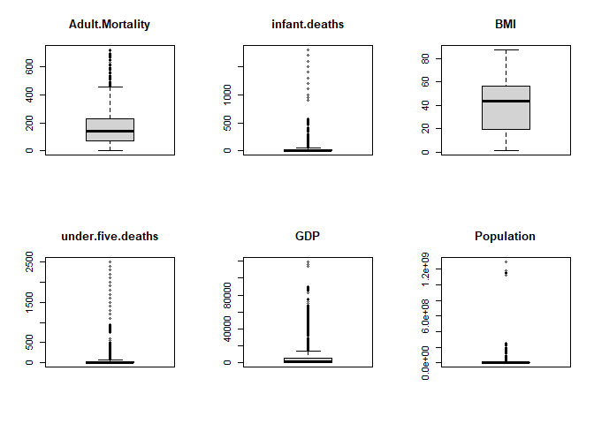<!-- -->

(ToDo: Rewrite the following part if needed)

After examining the mentioned values, it appears that some of them could potentially be outliers, while others are most likely errors. To address these inconsistencies, the following modifications will be made, considering that the values are implausible:

- Adult mortality rates lower than the 5th percentile will be treated as null.\
- Infant deaths of 0 will be considered null.\
- BMIs below 10 and above 50 will be considered null.\
- Under Five deaths of 0 will be considered null.\
By making these adjustments, we can handle the values that do not align with reasonable expectations.


```r
num_na_before <- sum(colSums(is.na(LifeExp)))
mort_5_percentile <- quantile(LifeExp$Adult.Mortality[!is.na(LifeExp$Adult.Mortality)], probs = 0.05)
LifeExp$Adult.Mortality <- ifelse(LifeExp$Adult.Mortality < mort_5_percentile, NA, LifeExp$Adult.Mortality)
LifeExp$infant.deaths <- ifelse(LifeExp$infant.deaths == 0, NA, LifeExp$infant.deaths)
LifeExp$BMI <- ifelse(LifeExp$BMI < 10 | LifeExp$BMI > 50, NA, LifeExp$BMI)
LifeExp$under.five.deaths <- ifelse(LifeExp$under.five.deaths == 0, NA, LifeExp$under.five.deaths)
```


```r
cat(num_na_before, sum(colSums(is.na(LifeExp))))
```

```
## 2563 5763
```
As we can see, we increased the number of missing values from 2563 to 5763. There seems to be a significant number of null values in the dataset. For now, it might be helpful to analyze separately just the columns that contain nulls to gain more insights. The following function aims to achieve this. It identifies and presents the columns that have explicit null values, tracks the total count of such columns along with their positions in the dataframe, and provides the count and percentage of nulls for each specified column.


```r
nulls_breakdown <- function(df) {
  df_cols <- colnames(df)
  cols_total_count <- length(df_cols)
  cols_count <- 0
  for (loc in 1:length(df_cols)) {
    col <- df_cols[loc]
    null_count <- sum(is.na(df[[col]]))
    total_count <- length(df[[col]])
    percent_null <- round(null_count / total_count * 100, 2)
    if (null_count > 0) {
      cols_count <- cols_count + 1
      cat("[", loc - 1, "] ", col, " has ", null_count, " null values: ", percent_null, "% null\n", sep = "")
    }
  }
  cols_percent_null <- round(cols_count / cols_total_count * 100, 2)
  cat("Out of ", cols_total_count, " total columns, ", cols_count, " contain null values; ", cols_percent_null, "% columns contain null values.\n", sep = "")
}

nulls_breakdown(LifeExp)
```

```
## [3] Life.expectancy has 10 null values: 0.34% null
## [4] Adult.Mortality has 155 null values: 5.28% null
## [5] infant.deaths has 848 null values: 28.86% null
## [6] Alcohol has 194 null values: 6.6% null
## [8] Hepatitis.B has 553 null values: 18.82% null
## [10] BMI has 1456 null values: 49.56% null
## [11] under.five.deaths has 785 null values: 26.72% null
## [12] Polio has 19 null values: 0.65% null
## [13] Total.expenditure has 226 null values: 7.69% null
## [14] Diphtheria has 19 null values: 0.65% null
## [16] GDP has 448 null values: 15.25% null
## [17] Population has 652 null values: 22.19% null
## [18] thinness.10.19.years has 34 null values: 1.16% null
## [19] thinness.5.9.years has 34 null values: 1.16% null
## [20] Income.composition.of.resources has 167 null values: 5.68% null
## [21] Schooling has 163 null values: 5.55% null
## Out of 22 total columns, 16 contain null values; 72.73% columns contain null values.
```
#### Dealing with missing values

Given that approximately half of the values in the BMI variable are null, we decided that it would be the best to exclude this variable from the analysis.


```r
LifeExp <- LifeExp[, !(colnames(LifeExp) %in% c('BMI'))]
```

When dealing with NA values, there are multiple approaches that can be considered:

- Fill with the mean value: Replace the NA values with the mean value of the respective variable.
- Dropping:
  - Drop all rows that contain at least one NA value: Remove the rows from the dataset that have any NA values.
  - Drop rows that contain more than 50% NA values: Exclude the rows that have more than 50% NA values, while keeping the remaining rows. The NA values can be filled with the mean value.
- Interpolation: If the data represents a time series, interpolation techniques can be applied to estimate the missing values based on the existing data points.

Since we are dealing with time series data assorted by country, the best approach would be to interpolate the data by country. However, from a careful examination of the dataframe it can be seen that there are columns that have null values for each year for some countries. Therefore, we resort to imputation by year, as the second best possible method. This involves replacing the null values with the mean value of each respective year. Imputation of each year's mean is done in the following code snippet:


```r
imputed_data <- list()

for (year in unique(LifeExp$Year)) {
  year_data <- LifeExp[LifeExp$Year == year, ]
  for (col in colnames(year_data)[4:length(colnames(year_data))]) {
    year_data[, col] <- ifelse(is.na(year_data[, col]), mean(year_data[, col], na.rm = TRUE), year_data[, col])
  }
  imputed_data <- append(imputed_data, list(year_data))
}

LifeExp <- bind_rows(imputed_data)

nulls_breakdown(LifeExp)
```

```
## Out of 21 total columns, 0 contain null values; 0% columns contain null values.
```
As we can see the missing values have been successfully handled using the interpolation method. We can now proceed to address the issue of outliers. Outliers can have a significant impact on data analysis and modeling, and it is important to identify and handle them appropriately.


### Outlier analysis

Outlier analysis is an essential step in exploring and understanding life expectancy data. It helps ensure data quality, identify anomalies and patterns, improve statistical analysis, inform policy decisions, and enhance data visualization and reporting.
Outliers increase the error variance and reduce the power of statistical tests. They can cause bias and/or influence estimates. They can also impact the basic assumption of regression as well as other statistical models.

Similar to missing values, to address the presence of outliers in the data, several steps can be taken:

1. Outlier detection: Identify the outliers in the dataset using appropriate statistical methods or techniques.
  - Visualization: Create boxplots and histograms to visually inspect the distribution of the data and identify any potential outliers.
  - Tukey's method: Apply Tukey's method or other outlier detection algorithms to determine the presence of outliers based on statistical thresholds or criteria.
2. Outlier treatment: Decide on the approach for handling outliers. Options include:
  - Dropping outliers: Remove the outlier observations from the dataset.
  - Limiting/Winsorizing outliers: Cap the extreme values at a predetermined threshold.
  - Transforming the data: Apply transformations such as logarithmic, inverse, or square root transformations to reduce the impact of outliers.

Each of these steps aims to identify, assess, and appropriately handle the outliers in the dataset to ensure robust analysis and accurate interpretations.


#### Outlier detection

For each continuous variable in the dataset, a boxplot will be generated, displaying the median, quartiles, and any potential outliers. Additionally, histograms will be created to visualize the frequency distribution of the variable.

By examining these plots, we can visually inspect the data and determine if there are any data points that deviate significantly from the majority of the observations, indicating the presence of potential outliers.

ToDo: Improve the plots here. Idea: place the boxplot above/bellow the histogram - combo plot.


```r
cont_vars <- colnames(LifeExp)[4:length(colnames(LifeExp))]
num_vars <- length(cont_vars)
num_rows <- ceiling(sqrt(num_vars))
num_cols <- ceiling(num_vars / num_rows)

par(oma = c(0, 0, 0, 0))

par(mfrow = c(num_rows, num_cols))

for (i in 1:num_vars) {
  col <- cont_vars[i]
  
  # Reduce the inner margins to make the plots larger
  par(mar = c(2, 2, 1, 1))
  
  boxplot(LifeExp[, col], horizontal = TRUE, col = rgb(0.8, 0.8, 0, 0.5), frame = FALSE, main = paste(col))
  
  # Increase the inner margins for the histogram to make it taller
  par(mar = c(4, 2, 1, 1))
  
  hist(LifeExp[, col], col = rgb(0.2, 0.8, 0.5, 0.5), main = paste(col), xlab = "")
}
```

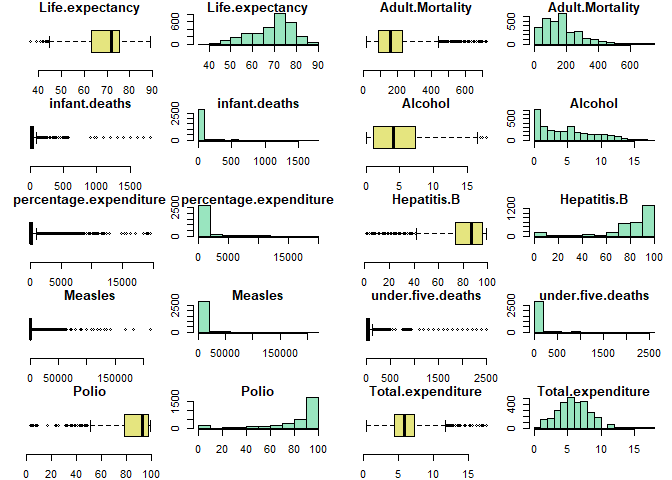<!-- -->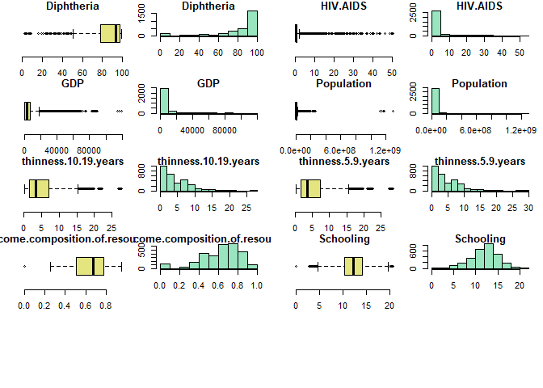<!-- -->
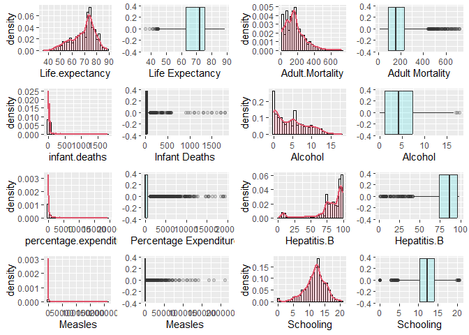<!-- -->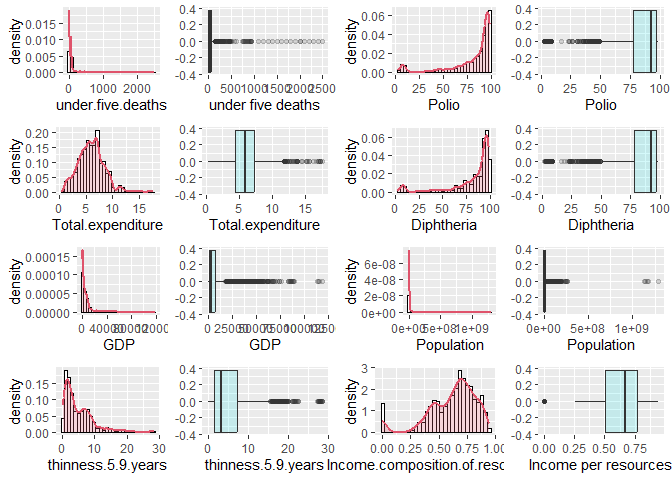<!-- -->

Visually inspecting the data, it is evident that there are several outliers present in the variables, including the target variable (life expectancy). To statistically identify outliers, Tukey's method can be applied. This method defines outliers as values that lie outside 1.5 times the interquartile range (IQR). By calculating the quartiles and IQR for each variable, the upper and lower bounds can be determined, and any values outside these bounds can be classified as outliers.


```r
LifeExp_old <- LifeExp
```


```r
cont_vars <- colnames(LifeExp)[4:length(colnames(LifeExp))]

outlier_counts <- sapply(LifeExp[cont_vars], function(x) {
  q1 <- quantile(x, 0.25)
  q3 <- quantile(x, 0.75)
  iqr <- q3 - q1
  lower_bound <- q1 - 1.5 * iqr
  upper_bound <- q3 + 1.5 * iqr
  outliers <- x < lower_bound | x > upper_bound
  sum(outliers, na.rm = TRUE)
})

outlier_percent <- outlier_counts / nrow(LifeExp) * 100

outliers_df <- data.frame(OutlierCount = outlier_counts, OutlierPercent = outlier_percent)
kable(outliers_df, format = "markdown")
```


|                                | OutlierCount| OutlierPercent|
|:-------------------------------|------------:|--------------:|
|Life.expectancy                 |           17|      0.5786249|
|Adult.Mortality                 |           97|      3.3015657|
|infant.deaths                   |          135|      4.5949626|
|Alcohol                         |            3|      0.1021103|
|percentage.expenditure          |          389|     13.2402995|
|Hepatitis.B                     |          222|      7.5561607|
|Measles                         |          542|     18.4479238|
|under.five.deaths               |          142|      4.8332199|
|Polio                           |          279|      9.4962560|
|Total.expenditure               |           51|      1.7358747|
|Diphtheria                      |          298|     10.1429544|
|HIV.AIDS                        |          542|     18.4479238|
|GDP                             |          300|     10.2110279|
|Population                      |          203|      6.9094622|
|thinness.10.19.years            |          100|      3.4036760|
|thinness.5.9.years              |           99|      3.3696392|
|Income.composition.of.resources |          130|      4.4247788|
|Schooling                       |           77|      2.6208305|

There seem to be a considerable number of outliers present in this dataset. Now that they have been identified, a question arises: What course of action should be taken regarding them?


#### Dealing with Outliers

There are several approaches to handling outliers in a dataset, and the typical options are as follows:

1. Discard Outliers (preferably avoided to retain maximum information):
   - This involves removing the data points that are considered outliers.
  
2. Apply Boundaries (Winsorization):
   - Set upper and/or lower limits for the values, effectively capping extreme values without removing them entirely.

3. Data Transformation:
   - Utilize mathematical transformations such as logarithmic, inverse, square root, etc.
   - Advantages: Can normalize the data and potentially eliminate outliers.
   - Disadvantages: Cannot be applied to variables containing values of zero or below, as it may lead to undefined results.


Given that each variable in the dataset exhibits a unique number of outliers and these outliers are distributed on different sides of the data, the most suitable approach would likely involve Winsorizing (limiting) the values for each variable individually until no outliers remain. The provided function bellow enables this process by iterating through each variable and allowing the specification of lower and/or upper limits for Winsorization. By default, the function generates two boxplots side by side for each variable, depicting the original data and the Winsorized data, respectively. Once a satisfactory limit is determined through visual analysis, the Winsorized data is saved in the wins_dict dictionary for convenient future access.


```r
test_wins <- function(col, lower_limit = 0, upper_limit = 0, show_plot = TRUE) {
  LifeExp_original <- LifeExp[[col]]
  q_low <- quantile(LifeExp[[col]], lower_limit)
  q_up <- quantile(LifeExp[[col]], 1 - upper_limit)
  LifeExp[[col]] <<- pmin(pmax(LifeExp[[col]], q_low), q_up)
  # <<- Allows us to modify variables outside of the local scope of a function.
  
  if (show_plot) {
    ylim <- range(LifeExp_original, na.rm = TRUE)
    par(mfrow = c(1, 2))
    boxplot(LifeExp_original, main = paste0("original\n ", col), ylim = ylim)
    boxplot(LifeExp[[col]], main = paste0("wins=(", lower_limit, ",", upper_limit, ")\n", col), ylim = ylim)
  }
}

test_wins(cont_vars[1], lower_limit = 0.01, show_plot = FALSE)
test_wins(cont_vars[2], upper_limit = 0.04, show_plot = FALSE)
test_wins(cont_vars[3], upper_limit = 0.05, show_plot = TRUE)
```

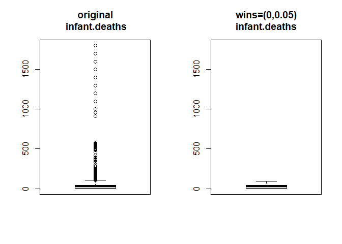<!-- -->

```r
test_wins(cont_vars[4], upper_limit = 0.0025, show_plot = FALSE)
test_wins(cont_vars[5], upper_limit = 0.135, show_plot = FALSE)
test_wins(cont_vars[6], lower_limit = 0.1, show_plot = FALSE)
test_wins(cont_vars[7], upper_limit = 0.19, show_plot = FALSE)
test_wins(cont_vars[8], upper_limit = 0.05, show_plot = FALSE)
test_wins(cont_vars[9], lower_limit = 0.1, show_plot = FALSE)
test_wins(cont_vars[10], upper_limit = 0.02, show_plot = FALSE)
test_wins(cont_vars[11], lower_limit = 0.105, show_plot = FALSE)
test_wins(cont_vars[12], upper_limit = 0.185, show_plot = FALSE)
test_wins(cont_vars[13], upper_limit = 0.105, show_plot = FALSE)
test_wins(cont_vars[14], upper_limit = 0.07, show_plot = FALSE)
test_wins(cont_vars[15], upper_limit = 0.035, show_plot = FALSE)
test_wins(cont_vars[16], upper_limit = 0.035, show_plot = FALSE)
test_wins(cont_vars[17], lower_limit = 0.05, show_plot = FALSE)
test_wins(cont_vars[18], lower_limit = 0.025, upper_limit = 0.005, show_plot = FALSE)
```

(ToDo: Create prettier graphs)


```r
# cont_vars <- colnames(LifeExp)[4:length(colnames(LifeExp))]
# num_vars <- length(cont_vars)
# num_rows <- ceiling(2)
# num_cols <- ceiling(num_vars / num_rows)
# 
# par(oma = c(0, 0, 0, 0))
# 
# par(mfrow = c(num_rows, num_cols))
# 
# for (i in 1:num_vars) {
#   col <- cont_vars[i]
#   
#   # Reduce the inner margins to make the plots larger
#   par(mar = c(2, 2, 1, 1))
#   
#   boxplot(LifeExp[, col], col = rgb(0.8, 0.8, 0, 0.5), frame = FALSE, main = paste(col))
#   
#   # Increase the inner margins for the histogram to make it taller
#   par(mar = c(4, 2, 1, 1))
# }
```

```r
# cont_vars <- colnames(LifeExp_old)[4:length(colnames(LifeExp_old))]
# num_vars <- length(cont_vars)
# num_rows <- ceiling(2)
# num_cols <- ceiling(num_vars / num_rows)
# 
# par(oma = c(0, 0, 0, 0))
# 
# par(mfrow = c(num_rows, num_cols))
# 
# for (i in 1:num_vars) {
#   col <- cont_vars[i]
#   
#   # Reduce the inner margins to make the plots larger
#   par(mar = c(2, 2, 1, 1))
#   
#   boxplot(LifeExp_old[, col], col = rgb(0.8, 0.8, 0, 0.5), frame = FALSE, main = paste(col))
#   
#   # Increase the inner margins for the histogram to make it taller
#   par(mar = c(4, 2, 1, 1))
# }
```

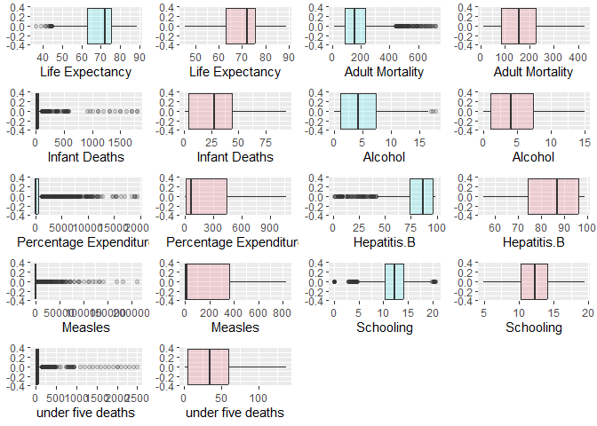<!-- -->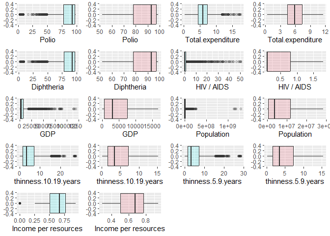<!-- -->


## Exploratory Data Analysis

### Histogram visualization

```r
library(rcompanion)

par(mfrow=c(2,2))

pnh_life_exp <- plotNormalHistogram(LifeExp$Life.expectancy, prob = FALSE, col="#B9D9EB", border="#003f5c",main = "Life Expectancy Histogram",length = 10000, linecol="#ffa600", lwd=3)

pnh_alch <- plotNormalHistogram(LifeExp$Alcohol, prob = FALSE, col="#B9D9EB", border="#003f5c",main = "Alcohol Histogram",length = 10000, linecol="#ffa600", lwd=3)

pnh_school <-plotNormalHistogram(LifeExp$Schooling, prob = FALSE, col="#B9D9EB", border="#003f5c",main = "Schooling",length = 10000, linecol="#ffa600", lwd=3)

pnh_gdp <- plotNormalHistogram(LifeExp$GDP, prob = FALSE, col="#B9D9EB", border="#003f5c",main = "GDP Histogram",length = 10000, linecol="#ffa600", lwd=3)
```

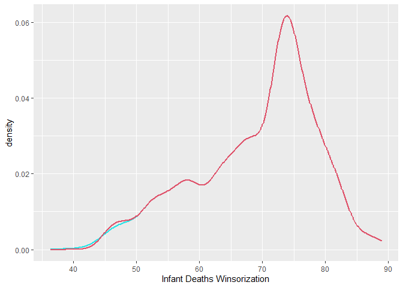<!-- -->

```r
pnh_gdp_log <- plotNormalHistogram(log(LifeExp$GDP), prob = FALSE, col="#B9D9EB", border="#003f5c",main = "GDP Log Histogram",length = 10000, linecol="#ffa600", lwd=3)

pnh_popul <- plotNormalHistogram(LifeExp$Population, prob = FALSE, col="#B9D9EB", border="#003f5c",main = "Population Histogram",length = 10000, linecol="#ffa600", lwd=3)

pnh_popul_log <- plotNormalHistogram(log(LifeExp$Population), prob = FALSE, col="#B9D9EB", border="#003f5c",main = "Population Log Histogram",length = 10000, linecol="#ffa600", lwd=3)
```

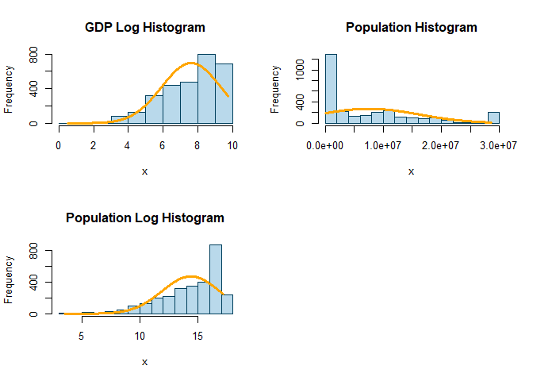<!-- -->


### 1. Developing vs Developed Countries

```r
ggplot(LifeExp, aes(x = Status, fill = Status)) + 
  geom_bar() + 
  scale_fill_manual(values = c("#ffa600","#bc5090")) + 
  labs(title = "Status of Country", x = "Status", y = "Count") +
  theme(axis.text = element_text(size = 8), axis.title = element_text(size = 8), 
        axis.text.y = element_text(size = 8), axis.title.y = element_text(size = 8))
```

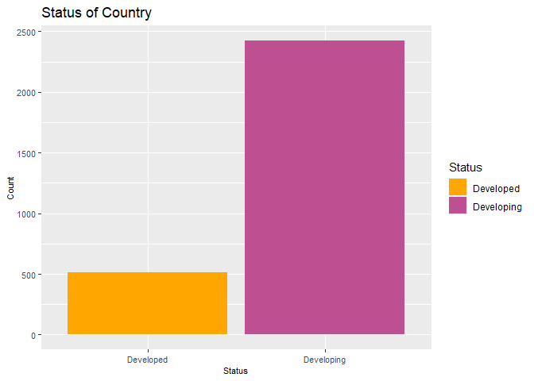<!-- -->


```r
ggplot(LifeExp, aes(x=Life.expectancy, fill=Status)) +
    geom_density(alpha=.5) +
    labs(title  = "Life Expectancy by Status", x ="Life Expectancy", y="Density") +
  scale_fill_manual(values = c("#FFA600", "#A05195"))
```

<!-- -->

### 2.Correlation between Health expenditure and Life expectancy.

Percentage Expenditure - Expenditure on health as a percentage of Gross Domestic Product per capita (%):
This indicator calculates the proportion of total health expenditure in relation to the Gross Domestic Product (GDP) per capita. It measures the share of the country's economic output (GDP) that is spent on healthcare per person. It provides insights into the financial commitment to healthcare relative to the economic well-being of the population. Higher values indicate a larger proportion of GDP per capita allocated to healthcare, suggesting greater investment in the health sector.

Total Expenditure - General government expenditure on health as a percentage of total government expenditure (%):
This indicator focuses specifically on the proportion of government expenditure that is allocated to healthcare. It calculates the share of total government expenditure that is dedicated to healthcare services and programs. It helps assess the priority given to healthcare within the government's overall budget allocation. Higher values indicate a greater emphasis on healthcare within the government's expenditure decisions.

The key distinction lies in the denominator used to calculate the proportions. Percentage expenditure considers the Gross Domestic Product per capita as the benchmark, while total expenditure focuses on the proportion of government expenditure dedicated to healthcare. Both indicators provide different perspectives on the allocation of resources to healthcare and can be used to evaluate financial commitments and priorities in the healthcare sector.


```r
life_expectancy_vs_percentage_expenditure <-  ggplot(LifeExp, aes(percentage.expenditure, Life.expectancy)) + 
                                      geom_jitter(color = "yellow", alpha = 0.5) + theme_light()

life_expectancy_vs_Total_expenditure  <- ggplot(LifeExp, aes(Total.expenditure, Life.expectancy)) +
                                      geom_jitter(color = "purple", alpha = 0.5) + theme_light()

p <- plot_grid(life_expectancy_vs_percentage_expenditure, life_expectancy_vs_Total_expenditure) 
title <- ggdraw() + draw_label("Correlation between Health expenditure and Life expectancy", fontface='bold')
plot_grid(title, p, ncol=1, rel_heights=c(0.1, 1))
```

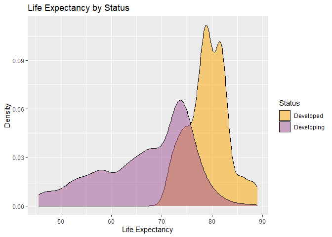<!-- -->
We can see from the above graph that the Higher Life Expectancy is more concentrated when expenditure varies from 5k - 20k.


### 3.Correlation between Health expenditure and Immunization.


```r
life_expectancy_vs_Hepatitis_B <- ggplot(LifeExp, aes(Hepatitis.B, Life.expectancy)) + geom_jitter(color = "purple", alpha = 0.5) + theme_light()

life_expectancy_vs_Diphtheria  <- ggplot(LifeExp, aes(Diphtheria, Life.expectancy)) + geom_jitter(color = "orange", alpha = 0.5) + theme_light()
                              
life_expectancy_vs_Polio  <- ggplot(LifeExp, aes(Polio, Life.expectancy)) + geom_jitter(color = "pink", alpha = 0.5) + theme_light()

life_expectancy_vs_Measles  <- ggplot(LifeExp, aes(Measles, Life.expectancy)) + geom_jitter(color = "light green", alpha = 0.5) + theme_light()

p <- plot_grid(life_expectancy_vs_Hepatitis_B, life_expectancy_vs_Diphtheria, life_expectancy_vs_Polio, life_expectancy_vs_Measles) 
title <- ggdraw() + draw_label("Correlation between Immunizations and life expectancy", fontface='bold')
plot_grid(title, p, ncol=1, rel_heights=c(0.1, 1))
```

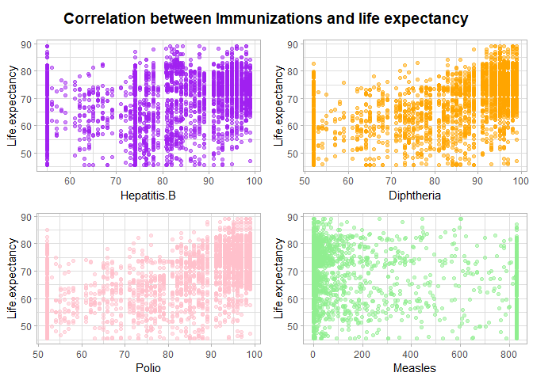<!-- -->
### 4. Life expectancy and Alcohol

Developed countries tend to have higher levels of alcohol consumption compared to developing countries. This can be attributed to various factors such as higher income levels, greater access to alcohol, more established alcohol industries, and different cultural norms surrounding alcohol.
Higher GDP at Developed countries can influence alcohol consumption patterns to some extent. As countries experience economic growth and an increase in GDP, there is often an associated rise in income levels and discretionary spending power. This can lead to increased alcohol consumption. 


```r
ggplot(LifeExp, aes(x=Alcohol, fill=Status)) +
    geom_density(alpha=.5) +
    labs(title  = "Alcohol consumption by Status", x ="Alcohol", y="Density") +
  scale_fill_manual(values = c("#FFA600", "#A05195"))
```

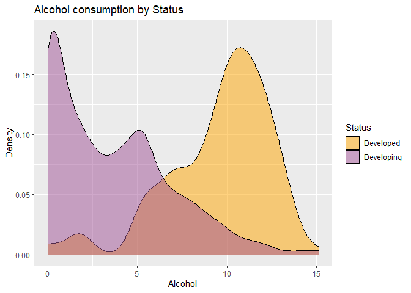<!-- -->

```r
ggplot(LifeExp, aes(x=log(GDP), fill=Status)) +
    geom_density(alpha=.5) +
    labs(title  = "GDP by Status", x ="GDP", y="Density") +
  scale_fill_manual(values = c("#FFA600", "#A05195"))
```

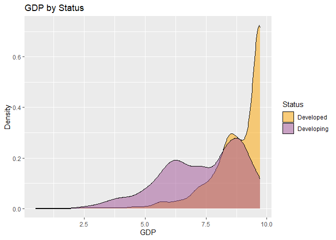<!-- -->


```r
life_expectancy_vs_Alcohol  <- ggplot(LifeExp, aes(Alcohol, Life.expectancy)) + geom_jitter(color = "#A05195", alpha = 0.5) + theme_light()
life_expectancy_vs_Alcohol 
```

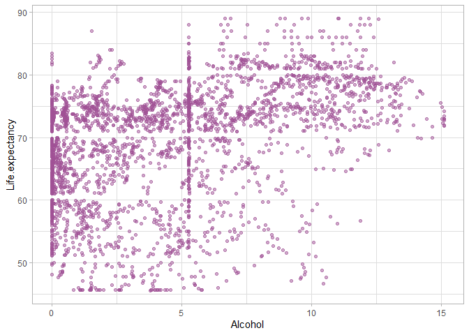<!-- -->


```r
life_expectancy_vs_Alcohol  <- ggplot(LifeExp, aes(Schooling, Life.expectancy)) + geom_jitter(color = "#A05195", alpha = 0.5) + theme_light()
life_expectancy_vs_Alcohol 
```

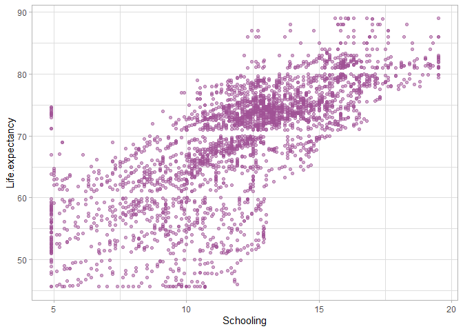<!-- -->


### 5. Correlation between Life expectancy and GDP

```r
life_expectancy_vs_GDP  <- ggplot(LifeExp, aes(GDP, Life.expectancy)) + geom_jitter(color = "lightblue", alpha = 0.5) + theme_light()
life_expectancy_vs_GDP 
```

<!-- -->

### 6. Correlation between Life expectancy Thinness


```r
life_expectancy_vs_thin5_9  <- ggplot(LifeExp, aes(thinness.5.9.years, Life.expectancy)) + geom_jitter(color = "orange", alpha = 0.5) + theme_light()
                              
life_expectancy_vs_thin10_19 <- ggplot(LifeExp, aes(thinness.10.19.years, Life.expectancy)) + geom_jitter(color = "pink", alpha = 0.5) + theme_light()

m <- plot_grid(life_expectancy_vs_thin5_9, life_expectancy_vs_thin10_19) 
title <- ggdraw() + draw_label("Correlation between Thinness and Life expectancy", fontface='bold')
plot_grid(title, m, ncol=1, rel_heights=c(0.1, 1))
```

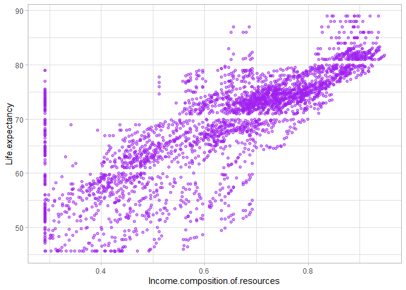<!-- -->


### 7. Correlation between Life expectancy and Income composition of resources

The term "Income composition of resources" refers to a component of the Human Development Index (HDI), which is a measure used to assess the overall development and well-being of a country's population. The Income composition of resources specifically focuses on income-related indicators and their contribution to human development.

In the context of the HDI, the Income composition of resources index is a numerical value that ranges from 0 to 1. It reflects the extent to which a country's income distribution contributes to overall human development.

A higher value of the Income composition of resources index indicates a more equitable distribution of income, where a larger proportion of the population has access to resources and opportunities for development. This suggests that income is shared more evenly among individuals within the country.

Conversely, a lower value of the index indicates a more unequal income distribution, with a smaller proportion of the population having access to resources and opportunities for development. This suggests that income is concentrated in the hands of a smaller segment of the population.


```r
life_expectancy_vs_incomecomp <- ggplot(LifeExp, aes(Income.composition.of.resources, Life.expectancy)) + geom_jitter(color = "purple", alpha = 0.5) + theme_light()

life_expectancy_vs_incomecomp
```

<!-- -->
By this scatterplot we can see that The Income composition of resources and their contribution to human development positively influences the Life Expectancy.

## Constructing Correlation Matrix


```r
# Compute the correlation matrix
numeric_vars <- LifeExp[, sapply(LifeExp, is.numeric)]
cor_matrix <- cor(numeric_vars)

# Plot the correlation matrix using corrplot
corrplot::corrplot(cor_matrix, method = "color", type = "upper", tl.cex = 0.7)
```

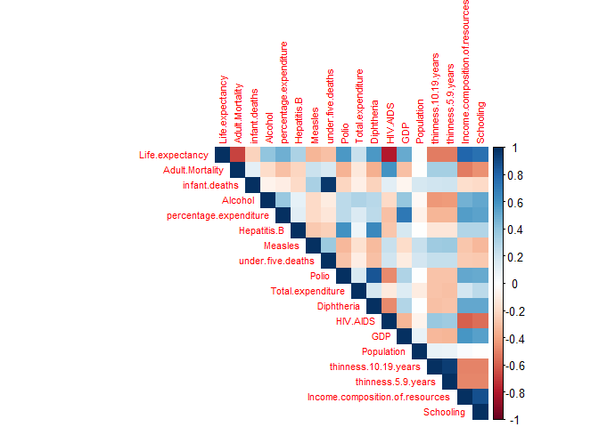<!-- -->

```r
# Adjust the text size
```
#### Network plot


```r
cor_matrix %>% corrr::network_plot(min_cor = .3)
```

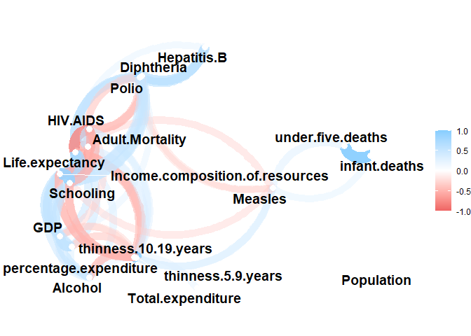<!-- -->


## Linear Regression

After completing the data cleaning process and exploring and engineering features, we can now move on to the main phase of this project: making predictions using linear regression. Initially, we will examine the effectiveness of a *simple linear regressor* (using only one feature). Then, we will progress to employing all the features through *multiple linear regression* or selecting a subset of features using appropriate techniques for *feature selection*.

Based on the exploratory data analysis (EDA), it is evident that our target variable, "Life expectancy," demonstrates the highest correlation with "Adult mortality." However, upon examining the scatter plot, it appears that this variable may not be suitable for linear regression. Therefore, we proceed by choosing the second most correlated variable, namely "Income.composition.of.resources". By observing the scatter plot for this particular variable, we can notice a linear trend.

Before we start, the question of whether to perform feature scaling arises. Feature scaling is not an absolute necessity for linear regression. The algorithm calculates the coefficients for each feature by computing the differences between the feature values and their mean. Therefore, feature scaling does not have a direct impact on the coefficients obtained from the linear regression model.

However, considering the benefits of feature scaling, such as ensuring consistent and meaningful comparisons, and the fact that it is a mandatory step when using regularization techniques, we have chosen to scale the data at the outset.

Afterward, to ensure unbiased evaluations, we proceed by randomly partitioning our dataset into separate training and test sets. For models that require cross-validation, we will utilize a portion of the training set as a validation set.


```r
LifeExp_scaled <- LifeExp %>% mutate(across(where(is.numeric), scale))
LifeExp_scaled_regression <- LifeExp_scaled %>% select(-Country, -Year)

train_percent <- 0.8
test_percent <- 1 - train_percent
num_rows <- nrow(LifeExp_scaled_regression)
train_size <- floor((train_percent) * nrow(LifeExp_scaled_regression))

set.seed(1)

train_indices <- sample.int(n = num_rows, size = train_size)

train <- LifeExp_scaled_regression[train_indices,]
test <- LifeExp_scaled_regression[-train_indices,]

cat("Train size: ", train_size, "\nTest size: ", num_rows - train_size)
```

```
## Train size:  2350 
## Test size:  588
```

```r
Y_colname <- "Life.expectancy"
X_colnames <- colnames(LifeExp_scaled_regression)[colnames(LifeExp_scaled_regression) != Y_colname]
```

### Simple linear regression

The linear regression equation is given by: $$ Y = \beta_0 + \beta_1 \cdot x + \varepsilon $$,\
where $$\beta_0$$ represents the intercept, $$\beta_1$$ represents the coefficient for the chosen feature "Income.composition.of.resources" and $$\varepsilon$$ represents a random error.


```r
simple_lm <- lm(Life.expectancy ~ Income.composition.of.resources, data = train)
summary(simple_lm)
```

```
## 
## Call:
## lm(formula = Life.expectancy ~ Income.composition.of.resources, 
##     data = train)
## 
## Residuals:
##      Min       1Q   Median       3Q      Max 
## -19.6095  -2.0897   0.1928   2.5570  25.0578 
## 
## Coefficients:
##                                 Estimate Std. Error t value Pr(>|t|)    
## (Intercept)                      41.2191     0.4628   89.06   <2e-16 ***
## Income.composition.of.resources  43.7221     0.6992   62.53   <2e-16 ***
## ---
## Signif. codes:  0 '***' 0.001 '**' 0.01 '*' 0.05 '.' 0.1 ' ' 1
## 
## Residual standard error: 5.817 on 2348 degrees of freedom
## Multiple R-squared:  0.6248,	Adjusted R-squared:  0.6247 
## F-statistic:  3910 on 1 and 2348 DF,  p-value: < 2.2e-16
```

The analysis reveals that the variable "Income.composition.of.resources" has a moderate-to-high level of explanatory power, as indicated by an R-squared value of 0.6248. This means that approximately 62.48% of the variability in life expectancy can be attributed to this variable.

Both the intercept and the coefficient associated with "Income.composition.of.resources" are highly significant, as indicated by the p-values being less than 2e-16. The F-statistic also supports this finding, with a value of 3910 and an extremely low p-value (< 2.2e-16), suggesting that the observed relationship is not due to chance.

The formula for the regression line can be expressed as follows:\
Life.Expectancy = 41.2191 + 43.7221 * Income.composition.of.resources\
and it is visualized bellow.


```r
simple_lm_no_intercept <- lm(Life.expectancy ~ 0 + Income.composition.of.resources, data = train)
summary(simple_lm_no_intercept)
```

```
## 
## Call:
## lm(formula = Life.expectancy ~ 0 + Income.composition.of.resources, 
##     data = train)
## 
## Residuals:
##     Min      1Q  Median      3Q     Max 
## -18.915  -6.183   0.740  10.477  48.775 
## 
## Coefficients:
##                                 Estimate Std. Error t value Pr(>|t|)    
## Income.composition.of.resources 103.8659     0.3793   273.9   <2e-16 ***
## ---
## Signif. codes:  0 '***' 0.001 '**' 0.01 '*' 0.05 '.' 0.1 ' ' 1
## 
## Residual standard error: 12.17 on 2349 degrees of freedom
## Multiple R-squared:  0.9696,	Adjusted R-squared:  0.9696 
## F-statistic: 7.499e+04 on 1 and 2349 DF,  p-value: < 2.2e-16
```


```r
ggplot(train, aes(x = Income.composition.of.resources, y = Life.expectancy)) +
  geom_point(color = "#80b1d3", size = 2, alpha = 0.9) +
  labs(x = "Income composition of resources", y = "Life expectancy") +
  theme_minimal() +
  theme(axis.text = element_text(size = 8),
        axis.title.x = element_text(size = 12),
        axis.title.y = element_text(size = 12)) +
  geom_abline(slope = coef(simple_lm)["Income.composition.of.resources"],
              intercept = coef(simple_lm)["(Intercept)"],
              color = "red", linetype = "solid", linewidth = 1.2)
```

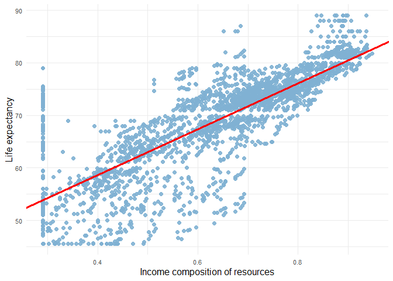<!-- -->
That’s not the whole picture though. Residuals could show how poorly a model represents data. Residuals are leftover of the outcome variable after fitting a model (predictors) to data, and they could reveal patterns in the data unexplained by the fitted model. Using this information, not only we can check if linear regression assumptions are met, but we can improve our model in an exploratory way.

Let’s now have a look at the *diagnostic plots*, in order to check whether Linear regression assumptions are met. These assumptions include:

1. **Linearity**: There should be a linear relationship between the predictors (x) and the outcome (y). This implies that the relationship between the variables can be adequately captured by a straight line or a linear combination of predictors.

2. **Independence of predictors**: The predictors (x) should be independent of each other, meaning there should be no significant correlation or multicollinearity among the predictor variables. This assumption ensures that the predictors contribute unique information to the model.

3. **No perfect multicollinearity**: The predictors should not exhibit perfect multicollinearity, which means that they should not be perfectly correlated with each other. Perfect multicollinearity can cause numerical instability and difficulties in estimating the regression coefficients.

4. **Error term with mean zero**: The residual errors (the differences between the observed outcome and the predicted outcome) should have a mean value of zero. This assumption assumes that, on average, the model is unbiased in its predictions.

5. **Constant variance of residuals (homoscedasticity)**: The residual errors should have a constant variance across the range of predicted values. This assumption implies that the spread of residuals is consistent, regardless of the predicted values.

6. **Independence of residuals**: The residual errors should be independent of each other and independent of the predictor variables (x). Independence of residuals assumes that the errors are not influenced by any patterns or structures in the data that are not captured by the predictor variables.

It is important to assess these assumptions before relying on the results of a linear regression model to ensure the validity of the model and the reliability of the inferences drawn from it.


```r
par(mfrow = c(2, 2))
plot(simple_lm)
```

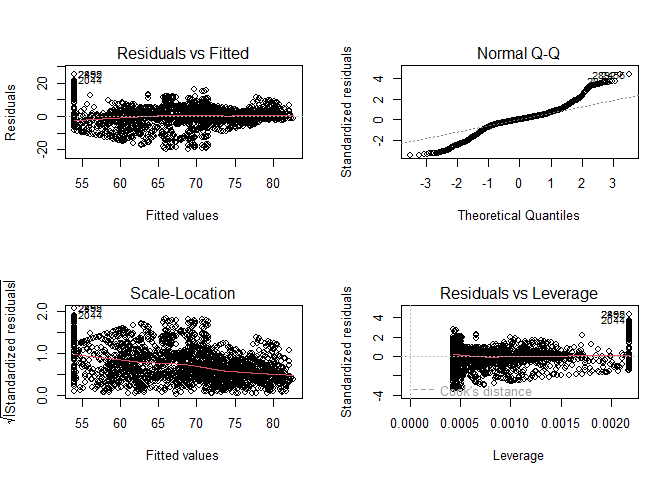<!-- -->
*Residuals vs Fitted*

This plot shows if residuals have non-linear patterns. There could be a non-linear relationship between predictor variables and the outcome variable, and the pattern could show up in this plot if the model doesn’t capture the non-linear relationship. In our case, we find almost equally spread residuals around a horizontal line without distinct patterns. So, this is a good indication that we don’t have non-linear relationships.

*Normal Q-Q*

This plot shows if residuals are normally distributed. Do residuals follow a straight line well or do they deviate severely? Thus for small sample sizes, it can't be assumed that the estimator $$\hat{\beta}$$ isn't Gaussian either, meaning the standard confidence intervals and significance tests are invalid. Our plot shows many points lying on the dotted line, however the rightmost and leftmost points are deviating from the line, suggesting slight right and left skewness.

*Scale-Location*

It's is also called a Spread-Location plot. This plot shows if residuals are spread equally along the ranges of predictors. This is how we can check the assumption of equal variance (*homoscedasticity*). It’s good if we see a horizontal line with equally (randomly) spread points, which is true in our case (the line is roughly horizontal).

*Residuals vs Leverage*

Leverage refers to the extent to which the coefficients in the regression model would change if a particular observation was removed from the dataset. Here, we watch out for outlying values at the upper right corner or at the lower right corner. Those spots are the places where cases can be influential against a regression line. When cases are outside of the dashed lines (meaning they have high “Cook’s distance” scores), the cases are influential to the regression results. The regression results will be altered if we exclude those cases.\
We can observe that there are not any influential points in our regression model.

By the previous analysis, we can conclude that our data is behaving linearly as we expected and it does have homoscedasticity.


```r
pred <- predict(simple_lm, newdata = test)
rmse <- sqrt(mean((test$Life.expectancy - pred)^2))
normalized_rmse_std <- sqrt(mean((pred - test$Life.expectancy)^2)) / sd(test$Life.expectancy)
normalized_rmse_range <- sqrt(mean((pred - test$Life.expectancy)^2)) / diff(range(test$Life.expectancy))
cat("RMSE =", rmse)
```

```
## RMSE = 5.562126
```

```r
cat("\nNormalized RMSE (sd)    =", normalized_rmse_std)
```

```
## 
## Normalized RMSE (sd)    = 0.5961559
```

```r
cat("\nNormalized RMSE (range) =", normalized_rmse_range)
```

```
## 
## Normalized RMSE (range) = 0.1281596
```
The normalized RMSE (sd) is 0.5961559, indicating that the model's predictions have an error of around 59.6 % of the standard deviation of the target variable. The normalized RMSE (range) is 0.1281596, suggesting that the model's predictions have an error of approximately 12.8% of the range of the target variable.

### Multiple linear regression

In this section we will train a regression model using multiple features. As part of the process we will select the most important features for the model using backward and forward selection and also check how well it performs on a test set.


```r
full_lm <- lm(train[,Y_colname] ~ ., data = train[, X_colnames])
summary(full_lm)
```

```
## 
## Call:
## lm(formula = train[, Y_colname] ~ ., data = train[, X_colnames])
## 
## Residuals:
##      Min       1Q   Median       3Q      Max 
## -15.2295  -2.0844   0.0793   2.0201  14.7919 
## 
## Coefficients:
##                                   Estimate Std. Error t value Pr(>|t|)    
## (Intercept)                      6.227e+01  8.811e-01  70.674  < 2e-16 ***
## StatusDeveloping                -1.840e+00  2.764e-01  -6.657 3.48e-11 ***
## Adult.Mortality                 -1.593e-02  9.182e-04 -17.352  < 2e-16 ***
## infant.deaths                    2.268e-03  1.224e-02   0.185 0.853018    
## Alcohol                          3.021e-02  2.671e-02   1.131 0.258277    
## percentage.expenditure           1.699e-03  3.057e-04   5.558 3.04e-08 ***
## Hepatitis.B                     -4.135e-02  7.288e-03  -5.674 1.57e-08 ***
## Measles                         -1.298e-03  2.753e-04  -4.714 2.58e-06 ***
## under.five.deaths               -1.387e-02  8.569e-03  -1.619 0.105617    
## Polio                            3.314e-02  9.697e-03   3.418 0.000641 ***
## Total.expenditure                6.244e-02  3.614e-02   1.728 0.084155 .  
## Diphtheria                       5.526e-02  1.028e-02   5.376 8.37e-08 ***
## HIV.AIDS                        -5.423e+00  1.651e-01 -32.844  < 2e-16 ***
## GDP                              4.084e-07  2.239e-05   0.018 0.985451    
## Population                       1.636e-08  9.438e-09   1.733 0.083194 .  
## thinness.10.19.years             9.371e-02  5.618e-02   1.668 0.095477 .  
## thinness.5.9.years              -2.096e-01  5.531e-02  -3.789 0.000155 ***
## Income.composition.of.resources  1.304e+01  1.008e+00  12.927  < 2e-16 ***
## Schooling                        1.489e-01  5.391e-02   2.761 0.005809 ** 
## ---
## Signif. codes:  0 '***' 0.001 '**' 0.01 '*' 0.05 '.' 0.1 ' ' 1
## 
## Residual standard error: 3.693 on 2331 degrees of freedom
## Multiple R-squared:  0.8499,	Adjusted R-squared:  0.8487 
## F-statistic: 733.3 on 18 and 2331 DF,  p-value: < 2.2e-16
```
The summary indicates that the residuals are symmetrically distributed, with a median almost equal to 0 (0.0793). We will examine the residuals more closely later. The full Linear regression model explains 84.99% of the variance associated with the response variable. The F-statistic is 733.3 (>> 1), and its p-value is nearly 0, providing clear evidence against the null hypothesis that all coefficients are equal to zero. This means that at least one variable is associated with the response. The p-values of the predictor variables allow us to determine their significance. Variables with lower p-values are more significant in relation to the response. Notably, features such as infant.deaths, Alcohol, under.five.deaths, and GDP are not statistically significant in our model.

To check the multicollinearity in our data we will look at the Variance Inflation Factors (VIF):


```r
vif_values <- vif(full_lm)
sorted_vif <- sort(vif_values, decreasing = TRUE)
vif_table <- data.frame(VIF = sorted_vif)
vif_table
```

<div class="kable-table">

|                                |       VIF|
|:-------------------------------|---------:|
|under.five.deaths               | 18.465112|
|infant.deaths                   | 17.257296|
|thinness.10.19.years            |  8.237359|
|thinness.5.9.years              |  8.159541|
|Income.composition.of.resources |  5.162196|
|Schooling                       |  4.729250|
|Diphtheria                      |  4.279891|
|Polio                           |  3.852056|
|GDP                             |  2.528120|
|percentage.expenditure          |  2.344432|
|HIV.AIDS                        |  2.164187|
|Alcohol                         |  1.853665|
|Status                          |  1.841310|
|Hepatitis.B                     |  1.770318|
|Adult.Mortality                 |  1.688498|
|Measles                         |  1.414444|
|Total.expenditure               |  1.199807|
|Population                      |  1.157712|

</div>

It is generally desirable to have VIF values as small as possible, closer to 1, which indicates low levels of collinearity.  As a rule of thumb VIF = 5 is taken as a threshold, and any independent variable with VIF > 5 will have to be removed, due to problematic amount of collinearity.

The VIF values for under.five.deaths, infant.deaths, thinness.10.19.years, thinness.5.9.years and Income.composition.of.resources have high values (> 5) that indicate collinearity problem. Therefore, we've decided to remove them from the model.


```r
cols_to_remove <- c("under.five.deaths", "infant.deaths", "thinness.10.19.years", "thinness.5.9.years", "Income.composition.of.resources")
X_colnames_reduced <- X_colnames[!(X_colnames %in% cols_to_remove)]


full_lm_low_vif <- lm(train[,Y_colname] ~ ., data = train[, X_colnames_reduced])
summary(full_lm_low_vif)
```

```
## 
## Call:
## lm(formula = train[, Y_colname] ~ ., data = train[, X_colnames_reduced])
## 
## Residuals:
##      Min       1Q   Median       3Q      Max 
## -15.4161  -2.2722   0.0527   2.1915  14.1934 
## 
## Coefficients:
##                          Estimate Std. Error t value Pr(>|t|)    
## (Intercept)             6.273e+01  8.568e-01  73.212  < 2e-16 ***
## StatusDeveloping       -2.145e+00  2.873e-01  -7.468 1.15e-13 ***
## Adult.Mortality        -1.805e-02  9.536e-04 -18.924  < 2e-16 ***
## Alcohol                 5.466e-02  2.765e-02   1.977   0.0481 *  
## percentage.expenditure  2.092e-03  3.204e-04   6.529 8.09e-11 ***
## Hepatitis.B            -4.042e-02  7.647e-03  -5.285 1.37e-07 ***
## Measles                -1.719e-03  2.741e-04  -6.272 4.23e-10 ***
## Polio                   4.009e-02  1.019e-02   3.937 8.51e-05 ***
## Total.expenditure       3.108e-02  3.736e-02   0.832   0.4055    
## Diphtheria              6.320e-02  1.079e-02   5.856 5.40e-09 ***
## HIV.AIDS               -5.812e+00  1.689e-01 -34.404  < 2e-16 ***
## GDP                     4.158e-05  2.331e-05   1.784   0.0746 .  
## Population              1.163e-08  9.843e-09   1.181   0.2377    
## Schooling               6.653e-01  4.200e-02  15.841  < 2e-16 ***
## ---
## Signif. codes:  0 '***' 0.001 '**' 0.01 '*' 0.05 '.' 0.1 ' ' 1
## 
## Residual standard error: 3.886 on 2336 degrees of freedom
## Multiple R-squared:  0.8334,	Adjusted R-squared:  0.8325 
## F-statistic:   899 on 13 and 2336 DF,  p-value: < 2.2e-16
```
As we can see after removing columns with high VIF, the R-squared value decreased. However, it is important to note that the primary goal of removing variables with high VIF is to address the issue of collinearity and improve the model's reliability and interpretability. We expect the adjusted model to be more appropriate for analysis and inference.

Let’s now have a look at the diagnostic plots.


```r
par(mfrow=c(2,2))
plot(full_lm_low_vif)
```

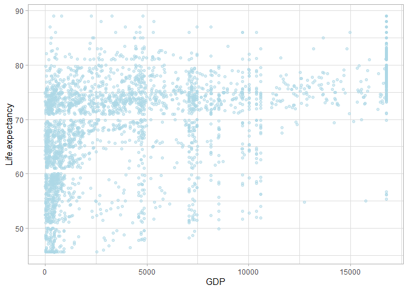<!-- -->

Fitted vs Residual graph\
The red line is very close to zero and the spread of the residuals is approximately the same across the x axis, so we have no discernible non-linear trends or indications of non-constant variance.

Normal Q-Q Plot\
The residuals deviate from the diagonal line in both the upper and lower tail. This plot indicates that the tails are ‘lighter’ (have smaller values) than what we would expect under the standard modeling assumptions.

Scale-Location\
The red line deviates just a little from horizontal, showing very small presence of heteroskedasticity.

Residuals vs Leverage\
In this plot we see no evidence of outliers. The “Cook’s distance” dashed curves don’t even appear on the plot. None of the points come close to having both high residual and leverage.


### Linear model (forward / backward model selection)

Next, we can explore approaches to reduce the variance of the model, namely backward and forward model selection. Empirically, backward selection tends to perform better in this regard. However, we also retain the forward selection method for comparison purposes.


Both feature selection techniques yielded the same results. So, for simplicity, we will show the results only for the backward selection method.


```r
#plot_subsets_summary(forward_sel_lm)
plot_subsets_summary(backward_sel_lm)
```

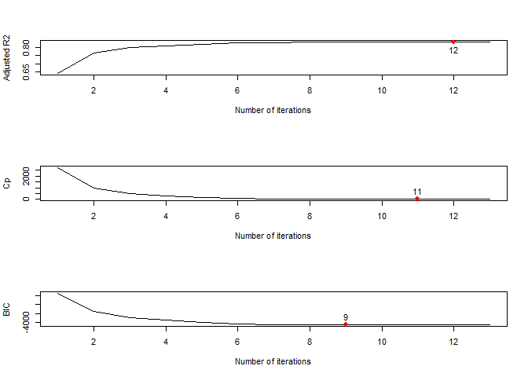<!-- -->

Based on the observed graphs, it is clear that different statistical measures, such as Cp, BIC, and Adjusted R-squared, produce varying results in the feature selection process. The use of Adjusted R-squared led to a model with one less variable compared to the original model. Cp resulted in the removal of two variables, while BIC suggested eliminating four variables from the model. Notably, Cp and AIC are equivalent and select the same model, hence we have focused on presenting the results based on Cp.


```r
# Get the chosen variables according to each statistical measure
backward_sel_lm_summary <- summary(backward_sel_lm)
vars_adjr2 <- names(coefficients(backward_sel_lm, which.max(backward_sel_lm_summary$adjr2)))
vars_cp <- names(coefficients(backward_sel_lm, which.min(backward_sel_lm_summary$cp)))
vars_bic <- names(coefficients(backward_sel_lm, which.min(backward_sel_lm_summary$bic)))

# Get the variables in the full model
vars_full_model <- names(coef(full_lm_low_vif))

# Create a data frame to store the included variables
selected_vars_df <- data.frame(Feature = vars_full_model, AdjR2 = 0, Cp = 0, BIC = 0)

# Update the data frame with the variables included in each model
selected_vars_df$AdjR2 <- as.numeric(selected_vars_df$Feature %in% vars_adjr2)
selected_vars_df$Cp <- as.numeric(selected_vars_df$Feature %in% vars_cp)
selected_vars_df$BIC <- as.numeric(selected_vars_df$Feature %in% vars_bic)

# Remove the intercept from the data frame
selected_vars_df <- selected_vars_df[-1, ]

kable(selected_vars_df, row.names = FALSE)
```


|Feature                | AdjR2| Cp| BIC|
|:----------------------|-----:|--:|---:|
|StatusDeveloping       |     1|  1|   1|
|Adult.Mortality        |     1|  1|   1|
|Alcohol                |     1|  1|   0|
|percentage.expenditure |     1|  1|   1|
|Hepatitis.B            |     1|  1|   1|
|Measles                |     1|  1|   1|
|Polio                  |     1|  1|   1|
|Total.expenditure      |     0|  0|   0|
|Diphtheria             |     1|  1|   1|
|HIV.AIDS               |     1|  1|   1|
|GDP                    |     1|  1|   0|
|Population             |     1|  0|   0|
|Schooling              |     1|  1|   1|

The feature selection algorithm consistently suggests that the variable "Total.expenditure" should be eliminated from the final model. This recommendation is supported by all three statistical measures. Furthermore, both Cp and BIC also favor removing the "Population" variable. From a practical standpoint, there are valid reasons for excluding these variables:

1. Population: Including the population of a country in the model is unlikely to have a direct impact on life expectancy. Therefore, it can be deemed unnecessary for predicting life expectancy accurately.

2. Total.expenditure: The information conveyed by the "Total.expenditure" variable is largely captured by the "percentage.expenditure" variable. Hence, including both variables in the model would introduce redundancy without significantly enhancing our understanding.

By excluding these variables, the final model becomes more concise and interpretable without compromising the explained variance to a great extent. However, it is essential to verify the impact on explained variance before drawing a definitive conclusion.

To represent the most significant variables, here we report the variable elimination plots:


```r
plot(backward_sel_lm, scale = 'r2')
```

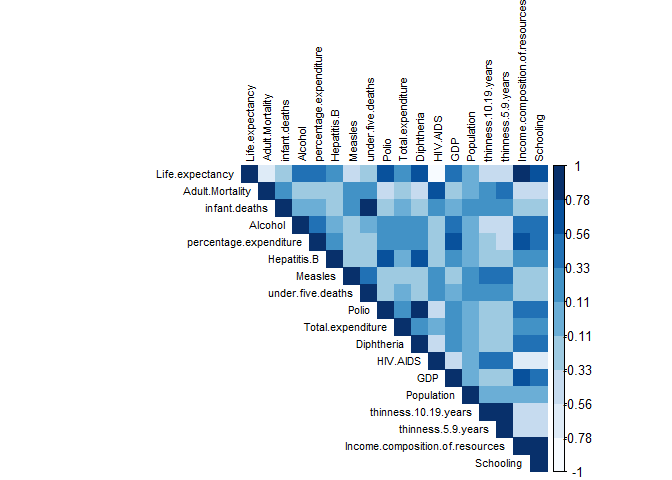<!-- -->

```r
plot(backward_sel_lm, scale = 'bic')
```

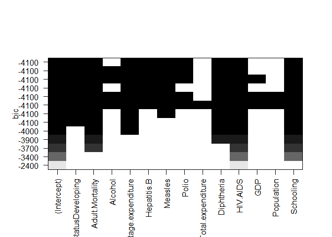<!-- -->

```r
plot(backward_sel_lm, scale = 'Cp')
```

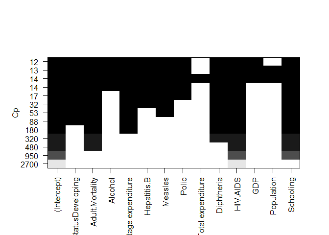<!-- -->

Based on the regsubsets plot, we reach the same conclusion as before. Therefore, we will proceed with removing the variables "Population" and "Total.expenditure" from our model. After removing these variables, we will retrain the multiple linear regressor using the updated set of features.


```r
cols_to_remove <- c("Population", "Total.expenditure")
X_colnames_reduced_featureSel <- X_colnames_reduced[!(X_colnames_reduced %in% cols_to_remove)]

featureSel_lm <- lm(train[,Y_colname] ~ ., data = train[, X_colnames_reduced_featureSel])
summary(featureSel_lm)
```

```
## 
## Call:
## lm(formula = train[, Y_colname] ~ ., data = train[, X_colnames_reduced_featureSel])
## 
## Residuals:
##      Min       1Q   Median       3Q      Max 
## -15.4801  -2.2937   0.0556   2.2285  14.4053 
## 
## Coefficients:
##                          Estimate Std. Error t value Pr(>|t|)    
## (Intercept)             6.288e+01  8.371e-01  75.123  < 2e-16 ***
## StatusDeveloping       -2.136e+00  2.848e-01  -7.503 8.84e-14 ***
## Adult.Mortality        -1.804e-02  9.534e-04 -18.921  < 2e-16 ***
## Alcohol                 5.850e-02  2.734e-02   2.140   0.0325 *  
## percentage.expenditure  2.035e-03  3.158e-04   6.444 1.41e-10 ***
## Hepatitis.B            -4.068e-02  7.639e-03  -5.325 1.10e-07 ***
## Measles                -1.657e-03  2.657e-04  -6.237 5.29e-10 ***
## Polio                   4.003e-02  1.018e-02   3.931 8.72e-05 ***
## Diphtheria              6.393e-02  1.077e-02   5.934 3.40e-09 ***
## HIV.AIDS               -5.819e+00  1.683e-01 -34.580  < 2e-16 ***
## GDP                     4.648e-05  2.275e-05   2.043   0.0412 *  
## Schooling               6.683e-01  4.189e-02  15.953  < 2e-16 ***
## ---
## Signif. codes:  0 '***' 0.001 '**' 0.01 '*' 0.05 '.' 0.1 ' ' 1
## 
## Residual standard error: 3.886 on 2338 degrees of freedom
## Multiple R-squared:  0.8333,	Adjusted R-squared:  0.8325 
## F-statistic:  1062 on 11 and 2338 DF,  p-value: < 2.2e-16
```
The variance explained by the model is 83.33%, which is nearly identical to the previous result (83.34%) achieved with the full model that included all variables except those displaying multicollinearity issues.


```r
hist(featureSel_lm$residuals)
```

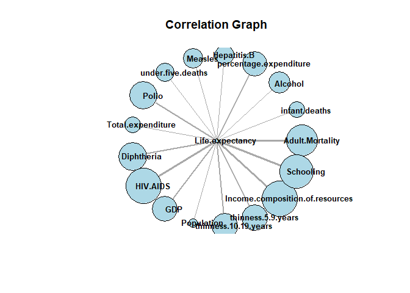<!-- -->
The histogram of the residuals exhibits a pattern that closely resembles a normal distribution. However, let's also check the QQ plot.


```r
plot(featureSel_lm, which = 2)
```

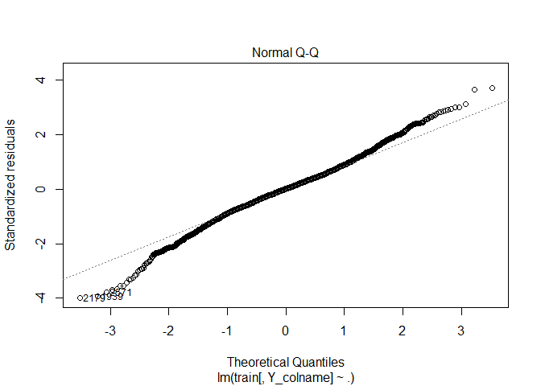<!-- -->
We can observe that the distribution has "fat" tails - both the ends of the Q-Q plot deviate from the straight line and its center follows a straight line. We refer to this as positive kurtosis (a measure of “Tailedness”).

Shapiro Test


```r
shapiro.test(residuals(featureSel_lm))
```

```
## 
## 	Shapiro-Wilk normality test
## 
## data:  residuals(featureSel_lm)
## W = 0.99059, p-value = 2.916e-11
```
In the context of the Shapiro-Wilk test, the null hypothesis is that the data is normally distributed. Since the p-value is significantly small (2.916e-11 << 0.05), it suggests strong evidence to reject the null hypothesis. Therefore, based on these results, it can be inferred that the residuals do not follow a normal distribution.


#### Data Transformation

To transform the data, we will apply the log transformation. Since there are 0s present in the data, we will use the formula log(1+x) to handle these values appropriately. We will only consider the variables that were selected earlier using multicollinearity check and feature selection. Initially, we exclude the binary variable "Status" when computing the log transformation. However, we will add it back later to enhance the linear model.

Additionally, we attempted using the square root transformation but did not observe any significant improvement in the model's performance.


```r
X_colnames_reduced_featureSel_noStatus <- X_colnames_reduced_featureSel[!X_colnames_reduced_featureSel %in% "Status"]

train_log <- train[, c(X_colnames_reduced_featureSel_noStatus, "Life.expectancy")]
train_log <- log1p(train_log) # sqrt
train_log$Status <- train$Status

log_featureSel_lm <- lm(Life.expectancy ~ ., data = train_log)
summary(log_featureSel_lm)
```

```
## 
## Call:
## lm(formula = Life.expectancy ~ ., data = train_log)
## 
## Residuals:
##       Min        1Q    Median        3Q       Max 
## -0.263920 -0.033866  0.003285  0.035179  0.235522 
## 
## Coefficients:
##                          Estimate Std. Error t value Pr(>|t|)    
## (Intercept)             3.7840942  0.0438304  86.335  < 2e-16 ***
## Adult.Mortality        -0.0160988  0.0017777  -9.056  < 2e-16 ***
## Alcohol                 0.0056048  0.0019406   2.888  0.00391 ** 
## percentage.expenditure  0.0036731  0.0005818   6.313 3.26e-10 ***
## Hepatitis.B            -0.0439703  0.0093591  -4.698 2.78e-06 ***
## Measles                -0.0032516  0.0005394  -6.029 1.92e-09 ***
## Polio                   0.0508325  0.0118350   4.295 1.82e-05 ***
## Diphtheria              0.0682942  0.0125062   5.461 5.24e-08 ***
## HIV.AIDS               -0.2010542  0.0047687 -42.161  < 2e-16 ***
## GDP                     0.0042964  0.0009735   4.413 1.06e-05 ***
## Schooling               0.1015325  0.0077221  13.148  < 2e-16 ***
## StatusDeveloping       -0.0377348  0.0043903  -8.595  < 2e-16 ***
## ---
## Signif. codes:  0 '***' 0.001 '**' 0.01 '*' 0.05 '.' 0.1 ' ' 1
## 
## Residual standard error: 0.06441 on 2338 degrees of freedom
## Multiple R-squared:  0.8011,	Adjusted R-squared:  0.8002 
## F-statistic: 856.2 on 11 and 2338 DF,  p-value: < 2.2e-16
```

```r
hist(log_featureSel_lm$residuals)
```

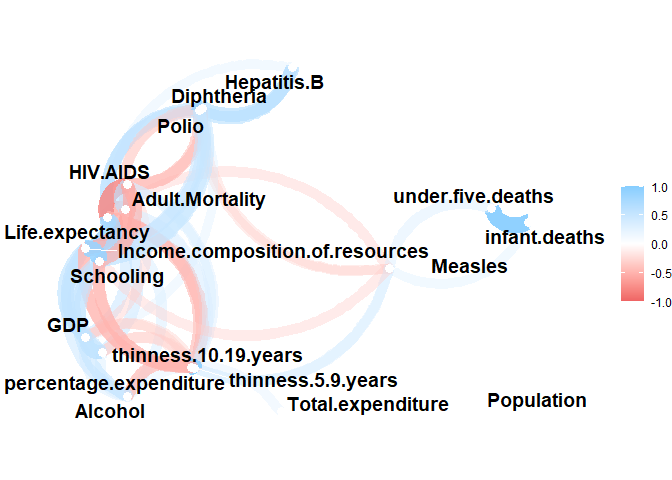<!-- -->


```r
shapiro.test(residuals(log_featureSel_lm))
```

```
## 
## 	Shapiro-Wilk normality test
## 
## data:  residuals(log_featureSel_lm)
## W = 0.97967, p-value < 2.2e-16
```
From the analysis of the histogram of the residuals and the results of the Shapiro-Wilk test, it can be concluded that the data transformation did not effectively address the issue of non-normality in the residuals. The residuals continue to deviate from the assumption of normality.


### Ridge regression

For the Ridge regression, it is necessary to standardize data. However, we already did this step.


```r
train$Status  <- as.numeric(train$Status) - 1
X = as.matrix(train[, X_colnames_reduced_featureSel])
Y = as.matrix(train[, Y_colname])

ridge_res = prepare_ridge_lasso(X = X,
                                Y = Y,
                                alpha = 0  # Ridge
                                )
```

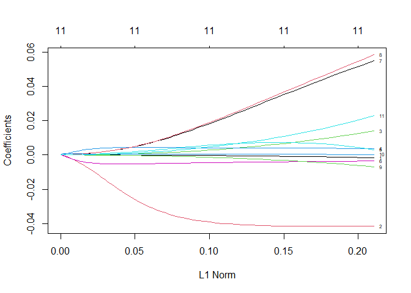<!-- -->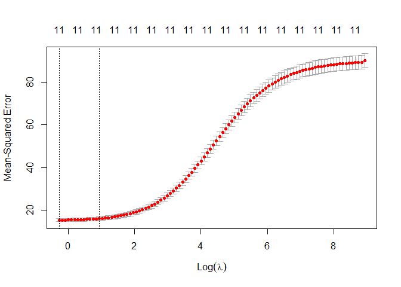<!-- -->

```
## Best lambda: 0.7588397
```

```r
ridge_model <- ridge_res$model
ridge_lambda <- ridge_res$lambda
test$Status  <- as.numeric(test$Status) - 1
ridge_pred <- predict(ridge_model,
                      s = ridge_lambda,
                      newx = as.matrix(test[, X_colnames_reduced_featureSel])
                      )
mean((ridge_pred - test$Life.expectancy)^2)
```

```
## [1] 28.65416
```

The value of best lambda is equal to 0.7588397
MSE with the best lambda: 28.65004

### Lasso regression


```r
lasso_res = prepare_ridge_lasso(X = X,
                                Y = Y,
                                alpha = 1  # Lasso
                                )
```

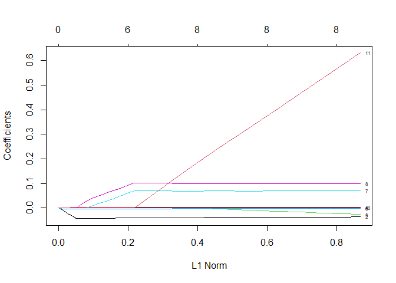<!-- -->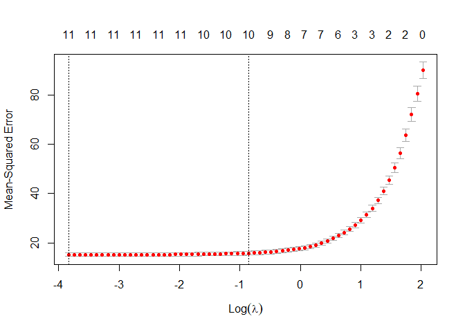<!-- -->

```
## Best lambda: 0.02161203
```

```r
lasso_model <- lasso_res$model
lasso_lambda <- lasso_res$lambda
lasso_pred <- predict(lasso_model,
                      s = lasso_lambda,
                      newx = as.matrix(test[, X_colnames_reduced_featureSel])
                      )
mean((lasso_pred - test$Life.expectancy)^2)
```

```
## [1] 22.82819
```

The value of best lambda is equal to: 0.02161203
MSE with the best lambda: 22.82819


We can see that the value of MSE of the lasso model is better than the ridge regularization model. So, we can conclude that the model with the L1 regularization term has slightly better predicting capabilities.


### Homoscedasticity


```r
bptest(featureSel_lm)
```

```
## 
## 	studentized Breusch-Pagan test
## 
## data:  featureSel_lm
## BP = 285.7, df = 11, p-value < 2.2e-16
```

```r
ols_test_breusch_pagan(featureSel_lm)
```

```
## 
##  Breusch Pagan Test for Heteroskedasticity
##  -----------------------------------------
##  Ho: the variance is constant            
##  Ha: the variance is not constant        
## 
##                      Data                      
##  ----------------------------------------------
##  Response : train[, Y_colname] 
##  Variables: fitted values of train[, Y_colname] 
## 
##          Test Summary           
##  -------------------------------
##  DF            =    1 
##  Chi2          =    142.9967 
##  Prob > Chi2   =    5.887799e-33
```
Using 2 different function to test the homoscedasticity, we still get conclusion that the residuals variance is not constant.


The linear model appears to be suitable for predicting Life.expectancy based on the Adj. R-Squared value. It successfully passed 2 out of 4 Assumption Checks, namely the Multicollinearity and Linearity Test, although it did not meet the criteria for Normality and Homoscedasticity.

The Linear Model can effectively capture the linear relationship between Life.expectancy and the chosen independent variables. Nevertheless, it's crucial to acknowledge that this model is particularly sensitive to outliers, which were prevalent in the initial dataset.


# TODO: Add comparison of models

- Bar graph for different statistics of models and a table summary

# TODO: Add best model summary
- Discuss the results obtained from the summary (check Anna B.'s analysis)
- Discuss whether the assumption checks are met


```r
ctable <- as.table(matrix(c(42, 6, 8, 28), nrow = 2, byrow = TRUE))
fourfoldplot(ctable, color = c("#CC6666", "#99CC99"),
             conf.level = 0, margin = 1, main = "Confusion Matrix")
```

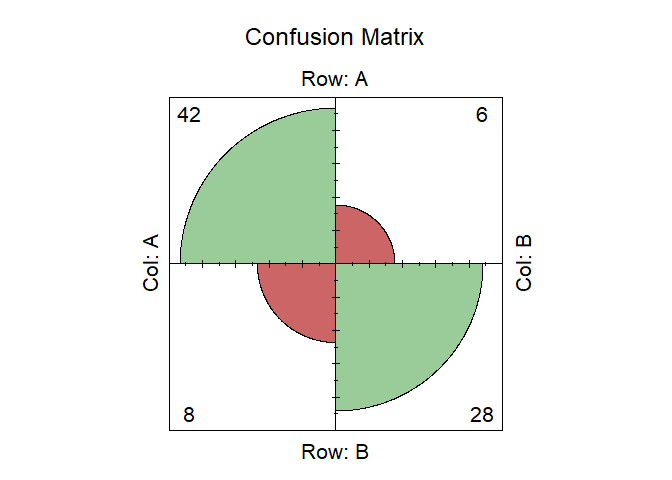<!-- -->


